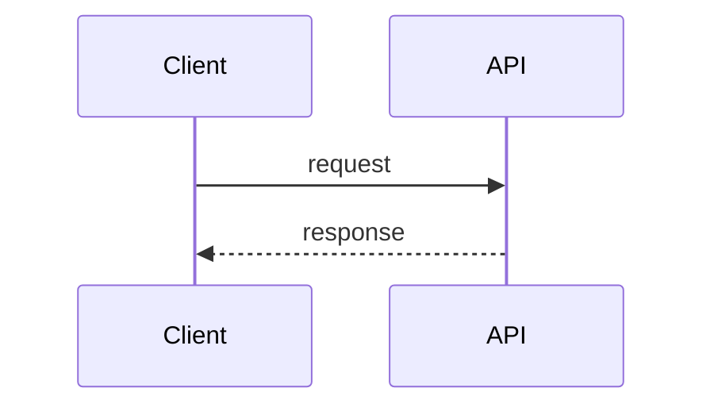

# Service Definition Reference

## Table of Contents

- [File shape](#file-shape)
- [Required front matter fields](#required-front-matter-fields)
- [Optional front matter fields](#optional-front-matter-fields)
- [Markdown body](#markdown-body)
  - [Mermaid diagrams](#mermaid-diagrams)
- [Discovery rules](#discovery-rules)
  - [Local catalog discovery](#local-catalog-discovery)
  - [Managed Git source discovery](#managed-git-source-discovery)
- [Catalog merge behavior](#catalog-merge-behavior)
- [Validation and error handling](#validation-and-error-handling)
- [Practical authoring rules](#practical-authoring-rules)
- [Minimal valid example](#minimal-valid-example)

This document describes the `service.md` file format used by `servdir`.

Each service entry is a Markdown file with:

- YAML front matter
- a Markdown body

`servdir` discovers these files, parses the front matter, renders the Markdown body, and validates the result.

## File shape

Example:

```md
---
id: billing-api
name: Billing API
owner: team-payments
lifecycle: production
repo: https://github.com/acme/billing-api
kind: service
description: Core billing service for invoice creation
tier: 2
tags:
  - payments
  - backend
depends_on:
  - auth-api
runbook: https://example.com/runbooks/billing-api
links:
  - label: Dashboard
    url: https://grafana.example.com/d/billing-api
  - label: Alerts
    url: https://alerts.example.com/billing-api
openapi:
  - label: Public API
    url: https://example.com/openapi/billing-api.yaml
delivery:
  - label: GitHub Actions
    url: https://github.com/acme/billing-api/actions
  - label: Deployment pipeline # CI & CD
    text: Managed in platform-infra repository
tech_stack:
  languages:
    - java
  frameworks:
    - spring
  data:
    - postgres
  platform:
    - kubernetes
  tooling:
    - github-actions
system: payments
domain: finance
---

# Billing API

Creates invoices and exposes billing functionality for internal systems.
```

The same front matter and Markdown body format also applies when a repository declares itself as a single catalog entry via a root-level `.servdir.md` file.

## Required front matter fields

These fields are required and validated.

### `id`

Unique service identifier.

Expected:

- non-empty string
- should be stable over time
- should be unique across the full merged catalog

Example:

```yaml
id: billing-api
```

Note:

- `id` remains the stable primary identifier even when `kind` broadens the entry type beyond classic services

Notes:

- duplicate ids are reported as validation errors
- the service route slug is currently derived from `id` by lowercasing it

### `name`

Human-readable display name.

Expected:

- non-empty string

Example:

```yaml
name: Billing API
```

### `owner`

Owning team or responsible group.

Expected:

- non-empty string

Example:

```yaml
owner: team-payments
```

### `lifecycle`

Current lifecycle state of the service.

Expected:

- non-empty string

Example values:

```yaml
lifecycle: production
lifecycle: experimental
lifecycle: deprecated
```

Note:

- current implementation validates only that it is a non-empty string
- it does not yet enforce a fixed enum

### `repo`

Repository URL for the service.

Expected:

- valid absolute URL

Example:

```yaml
repo: https://github.com/acme/billing-api
```

## Optional front matter fields

### `kind`

Optional catalog entry kind.

Expected:

- non-empty string

Example:

```yaml
kind: service
kind: application
```

Default behavior:

- if omitted, `servdir` defaults this field to `service`

Use this field when the catalog should include things broader than backend services, for example applications or other entry types.

Current built-in UI kind icons explicitly support: `service`, `tool`, `application`, `library`, `component`, and `iac`.
Other kind values are still allowed, but they currently fall back to the default icon.

### `description`

Short summary of the service.

Expected:

- string

Example:

```yaml
description: Core billing service for invoice creation
```

Used for:

- list page summary when present

If missing:

- the UI falls back to the first non-heading line from the Markdown body

### `tier`

Optional service tier.

Expected:

- positive integer

Example:

```yaml
tier: 2
```

### `tags`

List of searchable labels.

Expected:

- array of non-empty strings

Example:

```yaml
tags:
  - payments
  - backend
```

### `depends_on`

List of other service ids this service depends on.

Expected:

- array of non-empty strings

Example:

```yaml
depends_on:
  - auth-api
  - event-bus
```

Validation behavior:

- unresolved dependency ids are reported as warnings
- they do not block the service from loading

### `runbook`

Link to operational documentation.

Expected:

- valid absolute URL

Example:

```yaml
runbook: https://example.com/runbooks/billing-api
```

### `links`

Extra links shown as metadata.

Expected:

- array of objects
- each object must include:
  - `label`: non-empty string
  - `url`: valid absolute URL

Example:

```yaml
links:
  - label: Dashboard
    url: https://grafana.example.com/d/billing-api
  - label: Alerts
    url: https://alerts.example.com/billing-api
```

### `openapi`

OpenAPI specification references for the service.

Expected:

- array of objects
- each object must include:
  - `label`: non-empty string
  - `url`: valid absolute URL

Example:

```yaml
openapi:
  - label: Public API
    url: https://example.com/openapi/billing-api.yaml
```

This field is intended for machine-readable API definitions that are important enough to model separately from generic links.

### `delivery`

Delivery or pipeline references for the service.

Expected:

- array of objects
- each object must include:
  - `label`: non-empty string
- each object must also include at least one of:
  - `url`: valid absolute URL
  - `text`: non-empty string

Example:

```yaml
# Your CI & CD details
delivery:
  - label: GitHub Actions
    url: https://github.com/acme/billing-api/actions
  - label: Deployment pipeline 
    text: Managed in platform-infra repository
```

Use this field for CI/CD and delivery references that should be shown separately from generic links.

### `tech_stack`

Optional structured technology stack metadata.

Expected:

- object
- each category is optional
- each populated category must be an array of non-empty strings
- at least one category must be populated when `tech_stack` is present

Supported categories:

- `languages`
- `frameworks`
- `data`
- `platform`
- `tooling`

Example:

```yaml
tech_stack:
  languages:
    - java
  frameworks:
    - spring
  data:
    - postgres
  platform:
    - kubernetes
    - keycloak
  tooling:
    - maven
```

This field is intentionally shared across all entry kinds.
It is meant to stay structured enough for future grouping, icons, and filtering without introducing kind-specific schema branches too early.

### `system`

Optional larger system grouping.

Expected:

- string

Example:

```yaml
system: payments
```

### `domain`

Optional business or technical domain.

Expected:

- string

Example:

```yaml
domain: finance
```

### `platform`

Optional deployment platform or infrastructure context.

Expected:

- string (free-form, lowercase-with-hyphens recommended)

Example:

```yaml
platform: aws-prod
platform: on-prem
platform: legacy-k8s
platform: hetzner
```

Use this field to describe where an entry is deployed or hosted.
When more than one platform value is present in the catalog, the UI shows a platform grouping toggle that re-organises the list and card views by platform.

## Markdown body

Everything after the front matter is treated as the service documentation body.

The body is:

- stored as raw Markdown
- rendered to HTML for the detail page

Common uses:

- service overview
- operational notes
- architecture notes
- onboarding information
- links that do not belong in structured front matter

### Mermaid diagrams

Mermaid diagrams are supported as fenced code blocks in the body:

````md

````

The diagram is rendered client-side in the browser using the full Mermaid library.
All Mermaid diagram types are supported: flowcharts, sequence diagrams, class diagrams, ER diagrams, state machines, C4, gitgraph, Gantt, mindmaps, timelines, and more.

A collapsible "Show source" toggle is added below each rendered diagram.
If a diagram contains a syntax error it fails clearly — an error notice is shown with the raw source expanded — without breaking the rest of the service page.

## Discovery rules

`servdir` currently discovers service files by file path pattern, not by scanning arbitrary Markdown.

### Local catalog discovery

For the local catalog root from `LOCAL_CATALOG_PATH`, `servdir` scans:

```text
<catalog-root>/services/*/service.md
<catalog-root>/.servdir.md
```

Examples:

```text
/data/catalog/services/billing-api/service.md
/data/catalog/services/auth-api/service.md
/data/catalog/.servdir.md
```

That means:

- normal multi-entry catalogs still use `services/*/service.md`
- a repository can also declare itself as one single catalog entry with a root-level `.servdir.md`
- deeper nesting is not currently discovered automatically beyond those explicit patterns

### Managed Git source discovery

For each `GIT_SOURCE_<NAME>` variable, `servdir` syncs the repository into a local checkout path, then scans each configured scan path:

```text
<checkoutPath>/<scanPath>/*/service.md
<checkoutPath>/<scanPath>/.servdir.md
```

If no scan paths are configured, the repo root is scanned, which means:

```text
<checkoutPath>/*/service.md
<checkoutPath>/.servdir.md
```

Example config:

```env
GIT_SOURCE_CATALOG_MAIN=git@bitbucket.org:your-org/service-catalog.git|main|services,platform/services
GIT_SOURCE_FLUX_GITOPS=git@bitbucket.org:your-org/flux-gitops.git|main
```

This discovers paths like:

```text
/data/catalog-cache/catalog-main/services/billing-api/service.md
/data/catalog-cache/catalog-main/platform/services/auth-api/service.md
/data/catalog-cache/flux-gitops/.servdir.md
```

## Catalog merge behavior

`servdir` merges services from:

- local catalog files when `LOCAL_CATALOG_PATH` is configured
- all configured managed Git sources

Then it validates the merged set together.

Current validation includes:

- front matter schema validation
- duplicate `id` detection across all loaded sources
- unresolved `depends_on` references

## Validation and error handling

If front matter does not match the schema:

- the service is still loaded into the catalog
- validation issues are attached to the service
- fallback placeholder values are used for missing required fields where needed

This means broken entries remain visible instead of silently disappearing.

Examples of validation problems:

- missing `owner`
- invalid `repo` URL
- `tier` is not a positive integer
- `links[].url` is not a valid URL
- `openapi[].url` is not a valid URL
- `delivery[]` is missing both `url` and `text`
- `delivery[].url` is not a valid URL
- `tech_stack` is not an object
- `tech_stack` is present but all categories are empty
- `tech_stack.<category>` is not an array of non-empty strings
- duplicate `id`
- unresolved `depends_on`

## Practical authoring rules

Recommended conventions:

- keep `id` short, stable, and URL-safe
- use team names for `owner`
- keep `description` short, let the body carry the detail
- prefer absolute URLs for all links
- use `depends_on` only for meaningful dependencies
- keep `tech_stack` short and recognizable, favor common technology names over internal abbreviations
- keep one service per directory

## Minimal valid example

```md
---
id: auth-api
name: Auth API
owner: team-platform
lifecycle: production
repo: https://github.com/acme/auth-api
---

# Auth API

Handles authentication and token issuance.
```
